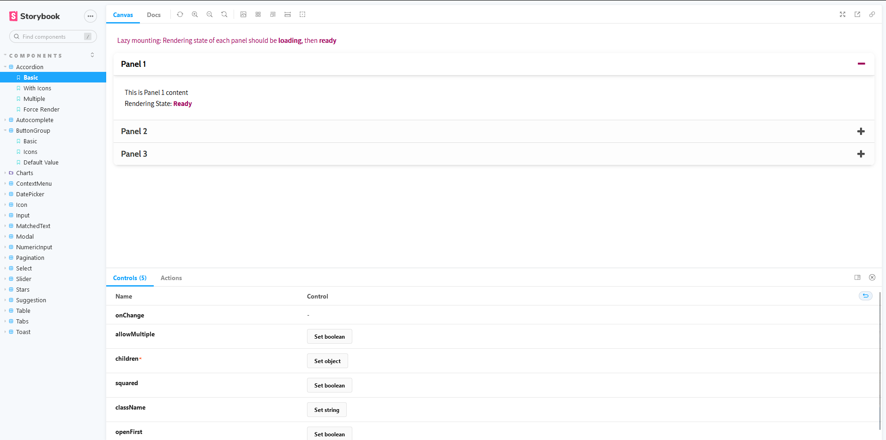

# A Collection of Foundation Components with Storybook

## Quick Start

The documentation and demo of the core components can be launched with the help of Storybook. Just run

```bash
yarn storybook
```

and this will open a browser window at http://localhost:6006 like the screenshot below



## List of Foundation Components

- Accordion
- Autocomplete
- ButtonGroup
- Charts
  - AreaChart
  - GroupedBarChart
  - HistogramChart
  - PieChart
  - StackedBarChart
- ContextMenu
- DatePicker
- Icon
- Input
- MatchedText
- Modal
- NumericInput
- Pagination
- Select
- Slider
- Stars
- Suggestion
- Table
- Tabs
- Toast

---
## Folder Structure
- `assets/` containing images, icons and fonts
- `components/` containing the components that can be reused
- `components/Foundation/` storing all the core components with generic implementation for reusability
- `components/Foundation/Stories/` includes Storybook documentation for each of the core components
- `config/` as its name suggests, should contain the overall configurations like i18n
- `hooks/` where custom hooks are placed
- `pages/`
- `types/` definition of entity types via prop-types
- `utils/` list of utility functions
- `vendor/` customization or overriding of any 3rd-party library's feature/styles

## Development Packages

The table below shows the main packages used in the project to address common problems:

| #   | Package                | Description                                                                                   |
|-----|------------------------|-----------------------------------------------------------------------------------------------|
| 1   | axios                  | sending RESTful API requests to the backend server                                            |
| 2   | bootstrap              | ensuring responsiveness and structuring document grid, col, row with prebuilt utility classes | 
| 3   | classnames             | manipulating element class names                                                              |
| 4   | font-awesome           | providing a collection of icons                                                               |
| 5   | formik                 | handling form data, used with `yup` for form validation                                       |
| 6   | i18next                | site languages and translation                                                                |
| 7   | prop-types             | validating the props of the components, an alternative for TypeScript                         |
| 8   | recharts               | providing various kinds of charts with capability of customization                            |
| 9   | @storybook/react       | documenting and demonstrating the core components                                             |
| 10  | @shopify/eslint-plugin | used with some other eslint plugins for code conventions and formatting                       |
| 11  | stylelint              | used with some other stylelint modules for validating and formatting `.scss` files            |

---

This project was bootstrapped with [Create React App](https://github.com/facebook/create-react-app).

## Available Scripts

In the project directory, you can run:

### `npm start`

Runs the app in the development mode.<br />
Open [http://localhost:3000](http://localhost:3000) to view it in the browser.

The page will reload if you make edits.<br />
You will also see any lint errors in the console.

### `npm test`

Launches the test runner in the interactive watch mode.<br />
See the section about [running tests](https://facebook.github.io/create-react-app/docs/running-tests) for more information.

### `npm run build`

Builds the app for production to the `build` folder.<br />
It correctly bundles React in production mode and optimizes the build for the best performance.

The build is minified and the filenames include the hashes.<br />
Your app is ready to be deployed!

See the section about [deployment](https://facebook.github.io/create-react-app/docs/deployment) for more information.

### `npm run eject`

**Note: this is a one-way operation. Once you `eject`, you can’t go back!**

If you aren’t satisfied with the build tool and configuration choices, you can `eject` at any time. This command will remove the single build dependency from your project.

Instead, it will copy all the configuration files and the transitive dependencies (webpack, Babel, ESLint, etc) right into your project so you have full control over them. All of the commands except `eject` will still work, but they will point to the copied scripts so you can tweak them. At this point you’re on your own.

You don’t have to ever use `eject`. The curated feature set is suitable for small and middle deployments, and you shouldn’t feel obligated to use this feature. However we understand that this tool wouldn’t be useful if you couldn’t customize it when you are ready for it.

## Learn More

You can learn more in the [Create React App documentation](https://facebook.github.io/create-react-app/docs/getting-started).

To learn React, check out the [React documentation](https://reactjs.org/).

### Code Splitting

This section has moved here: https://facebook.github.io/create-react-app/docs/code-splitting

### Analyzing the Bundle Size

This section has moved here: https://facebook.github.io/create-react-app/docs/analyzing-the-bundle-size

### Making a Progressive Web App

This section has moved here: https://facebook.github.io/create-react-app/docs/making-a-progressive-web-app

### Advanced Configuration

This section has moved here: https://facebook.github.io/create-react-app/docs/advanced-configuration

### Deployment

This section has moved here: https://facebook.github.io/create-react-app/docs/deployment

### `npm run build` fails to minify

This section has moved here: https://facebook.github.io/create-react-app/docs/troubleshooting#npm-run-build-fails-to-minify
